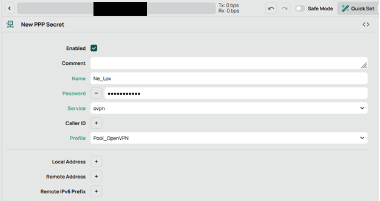
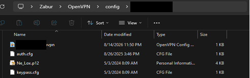

# MikroTik RouterOS to OpenVPN Zero-Touch Provisioning

A standardized, production-tested pipeline for deploying zero-touch OpenVPN client configurations connected to an enterprise MikroTik RouterOS gateway.

This repository documents the end-to-end setup: internal Public Key Infrastructure (PKI) enrollment, PPP secret provisioning, split-tunnel client bundle generation, and automation scripts resolving client runtime issues.

## Architecture Overview

Target Services Exposed via Tunnel:
* Active Directory / DNS: 10.10.1.10
* SMB File Shares & Internal NAS: 10.10.1.30
* Enterprise Mail & Database: 10.10.1.20, 10.10.1.50

## Tech Stack & Prerequisites

* Network Infrastructure: MikroTik RouterOS v6 / v7
* VPN Protocol: OpenVPN (TCP mode, TLS 1.0-1.2 support)
* Encryption Standards: AES-256-GCM / AES-256-CBC, RSA-2048, SHA-1
* Client Environment: Windows 10/11 Enterprise x64, OpenVPN Client 2.7.x
* Automation: PowerShell 5.1 / 7.x

## Step-by-Step Implementation Guide

### Phase 1: MikroTik Gateway Provisioning
1. Create PPP Secret Account:
   * Navigate to PPP -> Secrets -> Add New.
   * Set Name to employee username.
   * Set Password (complex alphanumeric string).
   * Set Service to ovpn.
   * Set Profile to Pool_OpenVPN.


2. Generate Endpoint Identity Certificate:
   * Navigate to System -> Certificates -> Add New.
   * Set Name and Common Name to employee username.
   * Set Key Size to 2048 and Days Valid to 3650.
   * Set Key Usage strictly to tls client.

3. Sign and Export:
   * Sign the certificate using the internal Certificate Authority (OVPN-CA).
   * Export the certificate with type PKCS12, assign export passphrase, and retrieve the .p12 artifact.

### Phase 2: Client Profile Deployment
Place the following bundle inside %USERPROFILE%\OpenVPN\config\<ProfileName>:
* client.ovpn: Connection profile with explicit split-tunnel static routes.
* username.p12: Exported PKCS#12 cryptographic bundle.
* auth.cfg: Two-line plain ANSI text file (PPP credentials).
* keypass.cfg: Single-line plain ANSI text file (PKCS#12 passphrase).


## Automation & Service Recovery

When running OpenVPN on modern Windows builds, missing background services or cached GUI states can cause crashes or connection drops.

Execute the maintenance script in an elevated PowerShell terminal:

```powershell
Set-ExecutionPolicy -Scope Process -ExecutionPolicy Bypass
.\scripts\Restart-OpenVpnService.ps1
```

## Verification & Diagnostic Commands

```powershell
# Verify Wintun interface status
Get-NetIPAddress -InterfaceAlias "*Wintun*", "OpenVPN TAP-Windows6*" | Select-Object IPAddress, InterfaceAlias

# Verify split-tunnel routes
Get-NetRoute -DestinationPrefix "10.10.1.30/32", "10.10.1.10/32"

# Test connectivity to SMB storage
Test-NetConnection -ComputerName 10.10.1.30 -Port 445
```

## Troubleshooting & Key Learnings

| Error Scenario | Root Cause | Resolution |
| :--- | :--- | :--- |
| cannot stat file: No such file (errno=2) | OpenVPN GUI searching in wrong execution directory or Windows hidden extensions. | Deploy config bundles to %USERPROFILE%\OpenVPN\config\<Subfolder> and verify extensions. |
| Wintun driver will not work | OpenVPNServiceInteractive Windows service is stopped or disabled. | Ensure service startup type is Automatic and restart the service. |
| Connection reset, restarting [-1] | Mismatch in credentials, expired client certificate, or TLS version mismatch. | Re-sign PKCS#12 bundle against CA with 10-year validity; verify password and cipher list. |
| CA not defined | PKCS#12 bundle missing Root CA chain in OpenVPN Connect v3. | Use OpenVPN Community Edition GUI or append inline ca blocks directly into the profile. |
## Copyright and License

Copyright (c) 2026 zazauzr. All rights reserved.

This repository and all its contents (including documentation, scripts, and configuration files) are proprietary. Unauthorized copying, modification, distribution, or commercial use of any materials from this repository, via any medium, is strictly prohibited without the express prior written permission of the copyright holder.
